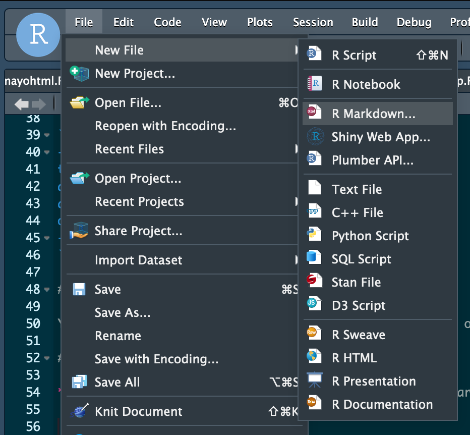
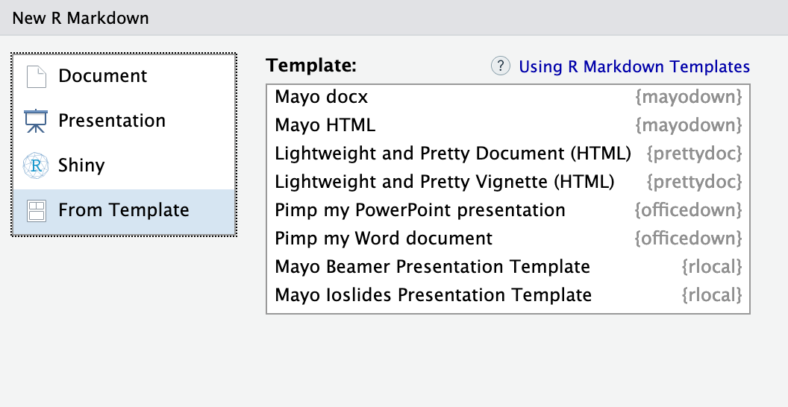

<!-- README.md is generated from README.Rmd. Please edit that file -->

# mayodown

<!-- badges: start -->

[](https://travis-ci.org/overdodactyl/mayodown)
<!-- badges: end -->

The goal of mayodown is to quickly generate Mayo themed R Markdown
documents with a standardized and polished look.

## Installation

You can install `mayodown` from GitHub:

``` r
# install.packages("devtools")
devtools::install_github("overdodactyl/mayodown")
```

## Supported Formats

`mayodown` supports the following outputs:

  - HTML document (based on `rmarkdown::html_document`)

  - Microsoft Word document (based on `officedown`)

  - remark.js slide presentation (based on `xaringan::moon_reader`)

Please contact the authors if additional formats are needed.

## Usage

To use, simply use the `mayohtml`, `mayodocx`, or `mayomoon_reader`
engine in your R Markdown header. For example:

``` yaml
---
title: "Mayo-Themed Rmarkdown"
author: First Last
date: "05 January, 2020"
output: mayodown::mayohtml
---
```

For more details along with examples, see the vignettes.

## Templates

You can open a `mayodown` template using RStudio or one of the
`mayodown::use_...` functions.

### RStudio

**Step 1:** Click the “New File” button and choose “R
Markdown”.



**Step 2:** In the “From Template” tab, choose one of the built-in
templates.



### `mayodown` Functions

You can also open a template using `mayodown::use_mayohtml`,
`mayodown::use_mayodocx` or `mayodown::use_mayomoon_reader`. Doing so
will create a new template and open the file in the text editor.
